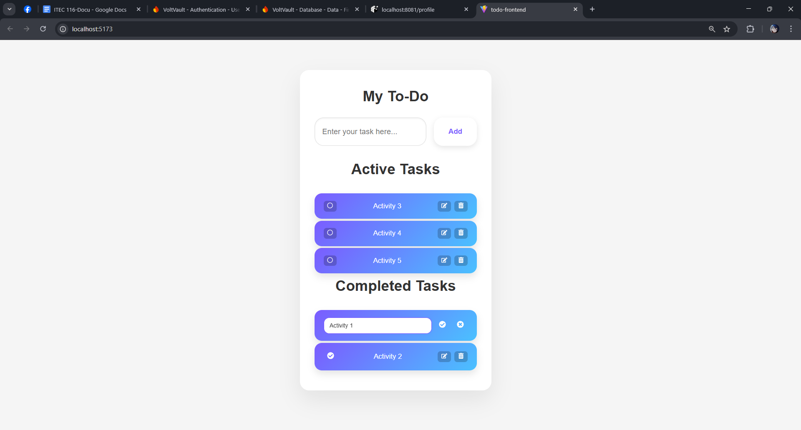

#  Activity 1 — To-Do List API + UI

This is a **full-stack to-do application** built with **NestJS** for the backend and **React** for the frontend.  
Users can create, update, delete, and mark tasks as complete.  
The backend exposes REST APIs (documented using **Swagger**), while the frontend provides an intuitive UI for managing and organizing tasks — implementing the **CRUD** operations.

---

## Overview

The **To-Do List Application** allows users to efficiently manage tasks.  
Users can:
- **Create** new tasks  
- **View** all tasks  
- **Update** existing tasks (title or completion status)  
- **Delete** tasks  
- **Organize** tasks into *Active* and *Completed* categories  

**Tech Stack:**
- **Backend:** NestJS + MongoDB  
- **Frontend:** React (Vite)  
- **API Documentation:** Swagger UI  

---

## ⚙️ Prerequisites

Before running the app, ensure you have:
- **Node.js v18+** installed  
- **MongoDB** running locally  
  (Default connection: `mongodb://localhost:27017/todo-app`)

---

## Instructions to Run the Project

### Backend (NestJS + MongoDB)

1. **Navigate to the backend directory:**

cd todo-backend

Install dependencies
npm install

Set up MongoDB connection:
Make sure MongoDB is running locally, or
Update the .env file with your connection string:

MONGO_URI=mongodb://localhost:27017/todo-app

---

Start the NestJS development server:
npm run start:dev
Open Swagger UI to test the API
http://localhost:3000/api

Frontend (React)
Navigate to the frontend directory:

cd todo-frontend
Install dependencies:

npm install

---

Start the React development server:
npm start
Open the app in your browse
http://localhost:5173

---

Usage Guide
Add new tasks using the input form.
Edit tasks by clicking the edit icon.
Mark tasks as completed/incomplete using the checkbox icon.
Delete tasks with the trash/delete icon.

Working System (Frontend UI)

---

Summary

This project demonstrates:
Integration of NestJS REST APIs with a React frontend
CRUD operations with MongoDB
Swagger for API documentation
Clean, responsive task management UI

BS Information Technology - Cavite State University