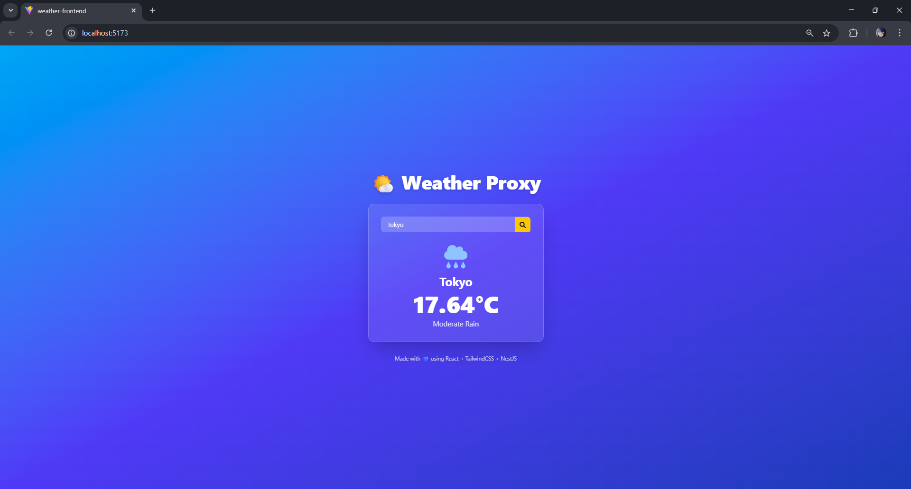

# Weather Proxy App

A simple full-stack **Weather Application** built with **NestJS (Backend)**, **React + Vite + TailwindCSS (Frontend)**, and **OpenWeatherMap API**.  
It allows users to input a city name and view real-time weather details such as **temperature** and **conditions** — all through a secure backend proxy.

---

##  Features

-  Fetch real-time weather data using **OpenWeatherMap API**
-  **NestJS backend proxy** to hide API key securely
-  **React (Vite)** frontend for fast UI rendering
-  **TailwindCSS** styling with glassmorphism and icons
-  Search city by clicking the button or pressing **Enter**
-  CORS-enabled backend connection
-  Responsive and animated design

---

## Project Structure

weather-proxy-app/
│
├── backend/ # NestJS Backend
│ ├── src/
│ │ ├── weather/
│ │ │ ├── weather.controller.ts
│ │ │ ├── weather.service.ts
│ │ │ └── weather.module.ts
│ │ ├── app.module.ts
│ │ └── main.ts
│ ├── .env # Contains OpenWeatherMap API key
│ └── package.json
│ 
│
├── frontend/ # React (Vite) Frontend
│ ├── src/
│ │ ├── App.jsx
│ │ ├── App.css
│ │ └── main.jsx
│ ├── vite.config.js
│ ├── package.json
│ └── index.html
│
└── README.md

---

Backend Setup (NestJS)

1️⃣ Install Dependencies
cd backend
npm install

2️⃣ Add Environment Variables
Create a .env file in the backend folder:
OPENWEATHERMAP_API_KEY=your_openweathermap_api_key_here

3️⃣ Enable CORS (for frontend)
Make sure your main.ts includes:
app.enableCors({
  origin: 'http://localhost:5173',
});

4️⃣ Run the Server
npm run start:dev
Backend runs by default on:
http://localhost:3000

Frontend Setup (React + Vite + Tailwind)
1️⃣ Install Dependencies
cd frontend
npm install

2️⃣ Run the Development Server
npm run dev
Frontend runs by default on:
http://localhost:5173

Technologies Used:

Frontend
React (Vite + JSX)
TailwindCSS
React Icons

Backend
NestJS
Axios
@nestjs/config (for environment variables)

API
OpenWeatherMap (https://openweathermap.org/api
)

Example Screenshot

Future Improvements
Display feels-like temperature, humidity, and wind speed
Auto-detect location via geolocation API
Save recent searches to MongoDB
Light/Dark mode toggle